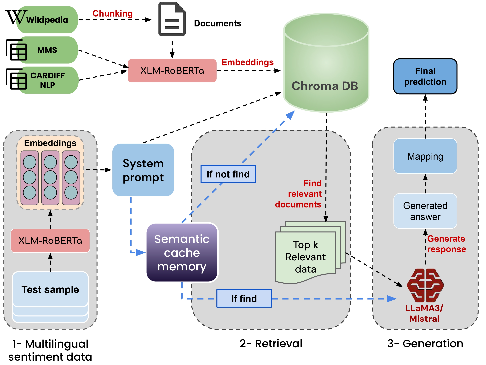
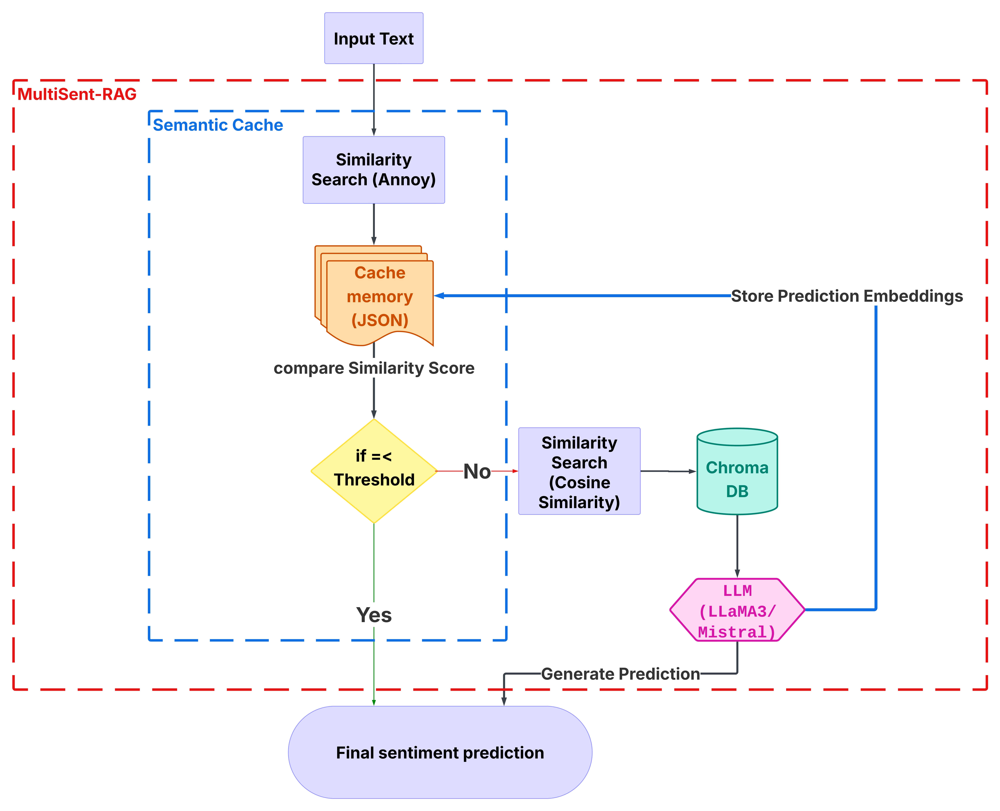

# MultiSent-RAG

Multilingual sentiment analysis using Retrieval-Augmented Generation (RAG) and semantic cache memory.

📄 **Paper:** [MultiSent-RAG: A Retrieval and Memory-Augmented System for Multilingual Sentiment Processing](https://doi.org/10.1016/j.ipm.2026.104990)  
*Information Processing & Management, Elsevier, 2026*  
Khouloud Mnassri, Reza Farahbakhsh, Noel Crespi

---

## What it does

MultiSent-RAG is a **training-free** sentiment classification system that works across 12 languages. Instead of fine-tuning, it retrieves relevant multilingual examples at inference time and feeds them to an LLM.

It comes in two variants:

- **MultiSent-RAG** — retrieves top-k documents from a Chroma vector store, builds a prompt, and runs inference with a quantized LLM
- **MultiSent-RAG-Cache** — adds a semantic cache layer (Annoy index) that reuses previous predictions when a new input is semantically similar, skipping retrieval and LLM inference entirely





---

## Languages

| Seen (Few-Shot) | Unseen (Zero-Shot) |
|----------------|-------------------|
| en, fr, ar, es, de, pt, hi, it | bg, fa, ja, zh |

---

## Stack

- **Embeddings:** `paraphrase-multilingual-mpnet-base-v2`
- **Vector store:** ChromaDB
- **LLMs:** Mistral-7B-Instruct, LLaMA-3-8B-Instruct (4-bit quantized)
- **Cache:** Annoy (angular distance, threshold = 0.9)
- **Baselines:** mBERT, XLM-R, BLOOMZ, LLaMA-3, Mistral

---

## Project Structure
MultiSent-RAG/

├── scripts/

│   ├── build_wikipedia.py          # Fetch and store Wikipedia knowledge

│   ├── build_vectorstore.py        # Build Chroma vector database

│   ├── run_baselines.py            # Run encoder and LLM baselines

│   ├── run_multisent_rag.py        # Run MultiSent-RAG across all languages

│   └── run_multisent_rag_cache.py  # Run MultiSent-RAG with semantic cache

├── src/

│   ├── baselines/

│   │   ├── encoder.py              # Encoder classifier (mBERT, XLM-R)

│   │   └── llm_classifier.py       # LLM classifier (BLOOMZ, LLaMA, Mistral)

│   ├── data/

│   │   ├── data_loader.py          # Load and split MMS test data

│   │   └── wikipedia_loader.py     # Wikipedia knowledge loader

│   ├── evaluation/

│   │   ├── baseline_evaluator.py

│   │   ├── rag_evaluator.py

│   │   └── metrics.py

│   ├── memory/

│   │   └── semantic_cache.py       # Semantic cache (core contribution)

│   └── pipeline/

│       └── multisent_rag.py        # RAG pipeline

├── assets/

│   ├── figure_1.jpg

│   └── figure_2.jpg

├── requirements.txt

└── README.md

---

## Installation

```bash
pip install -r requirements.txt
```

- Python 3.9+
- GPU recommended (change `device` to `"cpu"` if needed)
- For LLaMA 3 access: `huggingface-cli login`

---

## How to Run

### 1. Build knowledge base

```bash
python scripts/build_wikipedia.py
python scripts/build_vectorstore.py
```

### 2. Run baselines

```bash
python scripts/run_baselines.py
```

Switch models by editing `model_name` in the script (all options commented inside).

### 3. Run MultiSent-RAG

```bash
python scripts/run_multisent_rag.py
```

### 4. Run with Semantic Cache

```bash
python scripts/run_multisent_rag_cache.py
```

> Runs on English by default. Change `TEST_PATH` for other languages (e.g. `test_set_fr.csv`).

---

## Citation

```bibtex
@article{mnassri2026multisentrag,
  title     = {MultiSent-RAG: A Retrieval and Memory-Augmented System for Multilingual Sentiment Processing},
  author    = {Mnassri, Khouloud and Farahbakhsh, Reza and Crespi, Noel},
  journal   = {Information Processing \& Management},
  year      = {2026},
  publisher = {Elsevier},
  doi       = {10.1016/j.ipm.2026.104990}
}
```

---

## Contact

Khouloud Mnassri — khouloud.mnassri@telecom-sudparis.eu  
Samovar, Télécom SudParis, Institut Polytechnique de Paris